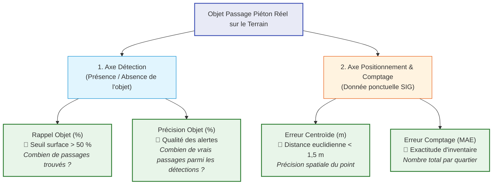

# 01 — L'importance capitale des métriques : ce qu'on souhaite vs ce qu'on écarte

Dans un projet de détection d'équipements urbains par vision par ordinateur, **le choix des métriques est une décision stratégique qui conditionne l'utilité réelle du modèle pour les services techniques et SIG de la collectivité**.

L'objectif final est de **détecter, compter et localiser les passages piétons sous forme de données vectorielles ponctuelles (points SIG)**.

---

## 🚫 1. Les métriques trompeuses à écarter formellement

### La précision globale par pixel (*Overall Pixel Accuracy*)
$$\text{Accuracy} = \frac{\text{Pixels Bien Classés}}{\text{Total des Pixels}}$$

- **Pourquoi elle est rejetée** :
  Dans notre jeu de données, les passages piétons ne représentent que **$0,6725\ \%$ de la surface de l'image** (99,3275 % de fond/bitume/bâtiments).
  Un modèle naïf (ou "aveugle") qui prédirait une image 100 % noire (tout à zéro) obtiendrait une précision de **$99,33\ \%$** tout en étant absolument inutile.
- **Verdict** : **REJETÉE / BANNIE**. Elle ne discrimine en rien la performance de détection.

---

## 🟡 2. Les métriques intermédiaires de segmentation (au pixel) : Utiles mais insuffisantes

Ces métriques évaluent la qualité du masque binaire raster produit par le réseau de neurones :

### L'IoU (*Intersection over Union* / Indice de Jaccard) sur la classe positive
$$\text{IoU} = \frac{\text{Vrais Positifs}}{\text{Vrais Positifs} + \text{Faux Positifs} + \text{Faux Négatifs}}$$

- **Rôle** : Mesure la superposition géométrique fine entre la zone blanche prédite et le tracé de référence au pixel près.
- **Intérêt** : C'est la métrique standard pour guider la fonction de perte (*loss*) et choisir la meilleure époque de checkpoint du réseau pendant l'entraînement.
- **Limites pour le métier** :
  Un modèle avec un très bon IoU (ex: 0,75) peut perdre quelques points uniquement parce que ses contours débordent de 2 pixels, tout en ayant détecté 100 % des passages piétons du territoire.
  Inversement, un modèle peut avoir un IoU correct tout en oubliant 20 % des passages de petite taille.
- **Verdict** : **CONSERVÉE COMME OBJECTIF D'OPTIMISATION DU RÉSEAU**, mais non représentative à elle seule de la valeur opérationnelle finale.

---

## 🎯 3. Les métriques cardinales d'intérêt métier (Niveau Objet & Donnée Ponctuelle)

### A. Taux de détection d'objet (*Object-level Recall*) — Seuil > 50 %
Un passage piéton réel est déclaré **trouvé** si au moins $50\ \%$ de sa surface au sol est recouverte par la prédiction du modèle :
$$\text{Rappel}_{\text{objet}} = \frac{\text{Nombre de passages piétons réels détectés}}{\text{Nombre total de passages piétons réels sur le terrain}}$$

- **Signification terrain** : Sur 100 passages piétons existant sur la voie publique, combien l'algorithme a-t-il été capable d'identifier ?
- **Priorité** : **MAXIMALE**. Une omission oblige un agent à pointer manuellement le passage manquant.

### B. Précision par objet (*Object-level Precision*)
$$\text{Précision}_{\text{objet}} = \frac{\text{Nombre de détections correspondant à un vrai passage}}{\text{Nombre total d'objets distincts générés par l'IA}}$$

- **Signification terrain** : Sur 100 objets ponctuels générés par l'IA sur la carte, combien sont de vrais passages piétons et combien sont des faux positifs (flèches, îlots, passages vélos, artefacts) ?
- **Priorité** : **ÉLEVÉE**. Un trop grand nombre de faux positifs pollue la base de données SIG.

### C. Erreur de localisation ponctuelle (*Centroid Positioning Error*)
Soit $(X_{\text{pred}}, Y_{\text{pred}})$ le centroïde du polygone prédit par l'IA et $(X_{\text{gt}}, Y_{\text{gt}})$ le centroïde de la vérité terrain :
$$\text{Erreur}_{\text{position}} = \sqrt{(X_{\text{pred}} - X_{\text{gt}})^2 + (Y_{\text{pred}} - Y_{\text{gt}})^2}\quad (\text{en mètres})$$

- **Signification terrain** : À quelle distance en mètres le point GPS calculé par l'IA se situe-t-il du centre physique réel du passage ?
- **Seuil d'acceptabilité SIG** :
  - $\le 1,0\text{ m}$ : **Excellente précision submétrique**.
  - $1,0\text{ à }2,0\text{ m}$ : **Conforme** (le point tombe sur le passage piéton).
  - $> 3,0\text{ m}$ : **Décalage / Erreur de géolocalisation**.

### D. Erreur absolue de comptage (*Count Error / MAE*)
Pour une zone ou un quartier donné :
$$\text{MAE}_{\text{comptage}} = \frac{1}{N} \sum_{i=1}^N |K_{\text{prédit}, i} - K_{\text{réel}, i}|$$

- **Signification terrain** : L'inventaire global du nombre de passages par commune / quartier est-il exact ?

---

## 📊 Synthèse récapitulative des métriques

| Métrique | Niveau | Rôle dans le projet | Cible visée |
|---|---|---|---|
| **Pixel Accuracy** | Pixel | ❌ **Rejetée** (trompeuse sur classe rare) | N/A |
| **IoU / Jaccard** | Pixel | 🟡 **Métrique d'entraînement** (qualité du masque) | $> 0,72$ |
| **Dice / F1-Pixel** | Pixel | 🟡 **Métrique d'entraînement** (équilibre précision/rappel) | $> 0,83$ |
| **Détection d'objet (> 50 %)** | Objet | 🎯 **Métrique Métier Cardinal** (exhaustivité du recensement) | **$> 88\ \%$** |
| **Précision Objet** | Objet | 🎯 **Métrique Métier Cardinal** (absence de fausses alertes) | **$> 85\ \%$** |
| **Erreur de Centroïde** | Ponctuel | 🎯 **Métrique Métier Cardinal** (précision géométrique SIG) | **$< 1,5\text{ m}$** |
| **Erreur de Comptage (MAE)** | Quartier | 🎯 **Métrique Métier Cardinal** (fiabilité de l'inventaire) | **$< 0,5$ obj/tuile** |
