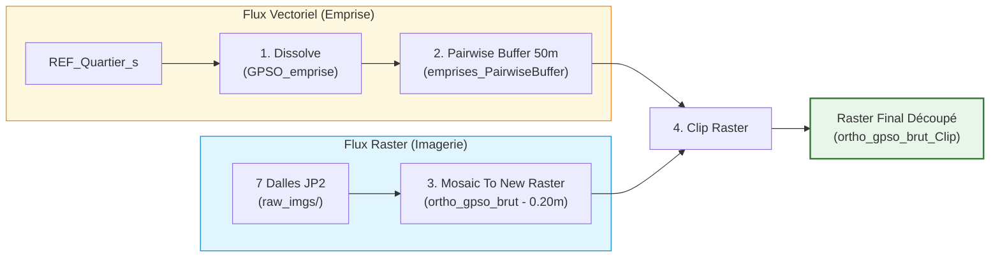

# 02 — Traitements géospatiaux sous ArcGIS Pro

Pour passer des 7 fichiers dalles disjoints à un raster d'imagerie continu découpé sur le territoire, 4 opérations géomatiques ont été exécutées dans ArcGIS Pro.

## Étape 1 : Fusion de l'emprise territoriale (`Dissolve`)

- **Outil** : `Geoprocessing → Dissolve` (Data Management Tools).
- **Donnée d'entrée** : Couche vectorielle des quartiers du territoire (`REF_Quartier_s`).
- **Nom de sortie** : `GPSO_emprise` (enregistré dans la géodatabase du projet `Default.gdb`).
- **Paramètre clé** : `Create multipart features = ON` (permet d'obtenir une entité unique même en présence de polygones disjoints).

---

## Étape 2 : Zone tampon de sécurité (`Pairwise Buffer 50m`)

- **Outil** : `Geoprocessing → Pairwise Buffer` (Analysis Tools).
- **Donnée d'entrée** : `GPSO_emprise`.
- **Nom de sortie** : `emprises_PairwiseBuffer` (ou `GPSO_emprise_buffer`).
- **Distance** : `50 Meters`.
- **Méthode** : `Planar` (adapté aux coordonnées métriques projetées Lambert-93).
- **Dissolve Type** : `Dissolve all output features into a single feature`.

### 💡 Pourquoi un buffer de 50 mètres ?
Les passages piétons situés exactement sur les voies limitrophes du territoire risquaient d'être tronqués net par le bord strict de la limite administrative. Un tampon de 50 mètres garantit que tous les carrefours périphériques et voies de ceinture sont capturés dans leur intégralité.

---

## Étape 3 : Assemblage du raster unifié (`Mosaic To New Raster`)

- **Outil** : `Geoprocessing → Mosaic To New Raster` (Data Management Tools).
- **Rasters d'entrée** : Les 7 dalles `.jp2` de `raw_imgs/`.
- **Nom de sortie** : `ortho_gpso_brut`.
- **Paramètres stricts** :
  - **Référence spatiale** : `Lambert-93 (RGF93 / Lambert-93, EPSG:2154)`.
  - **Type de pixel** : `8_BIT_UNSIGNED` (valeurs de 0 à 255).
  - **Taille de cellule (Cellsize)** : `0.2` (conserve rigoureusement la résolution native de 20 cm).
  - **Nombre de bandes** : `3` (Canaux Rouge, Vert, Bleu).
  - **Opérateur de mosaïque** : `LAST`.
  - **Mode de table de couleurs** : `FIRST`.

---

## Étape 4 : Découpage sur l'emprise tamponnée (`Clip Raster`)

- **Outil** : `Geoprocessing → Clip Raster` (Data Management Tools).
- **Raster d'entrée** : `ortho_gpso_brut`.
- **Emprise de sortie** : `emprises_PairwiseBuffer`.
- **Paramètres stricts** :
  - `Use Input Features for Clipping Geometry` : **Coché** (essentiel : découpe selon la forme polygonale exacte et non selon son rectangle englobant).
  - `Maintain Clipping Extent` : **Décoché**.
  - `NoData Value` : `256` ou vide.
- **Sortie finale** : Raster géoréférencé `ortho_gpso_brut_Clip`.
