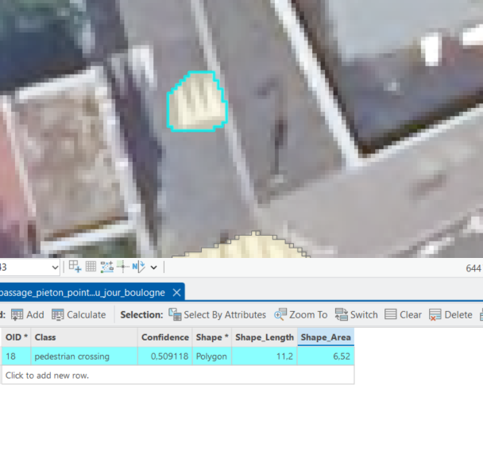
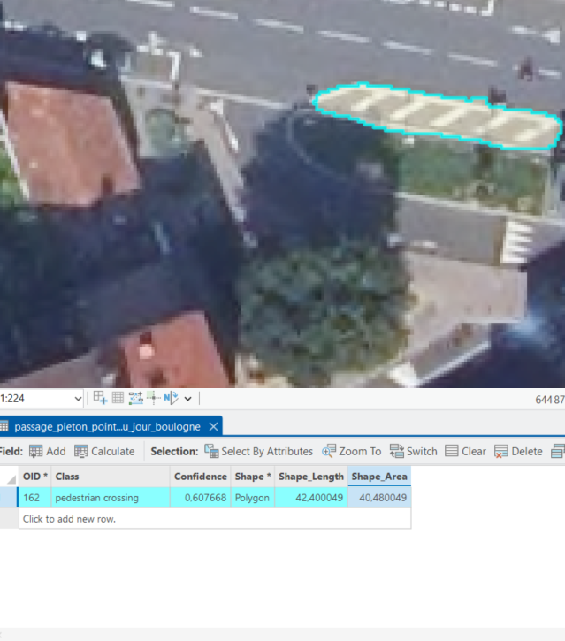
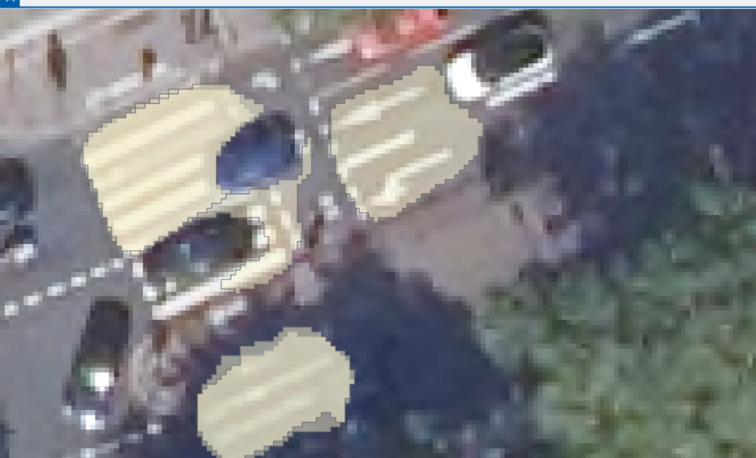
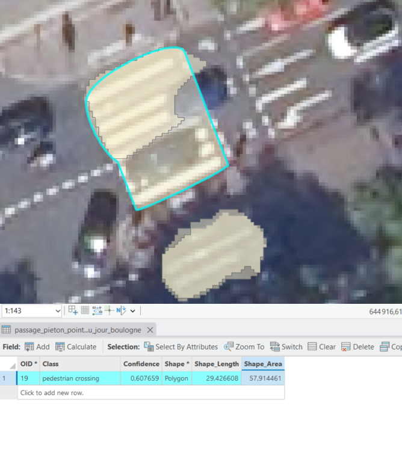
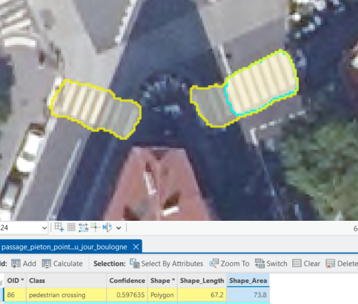
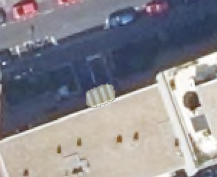
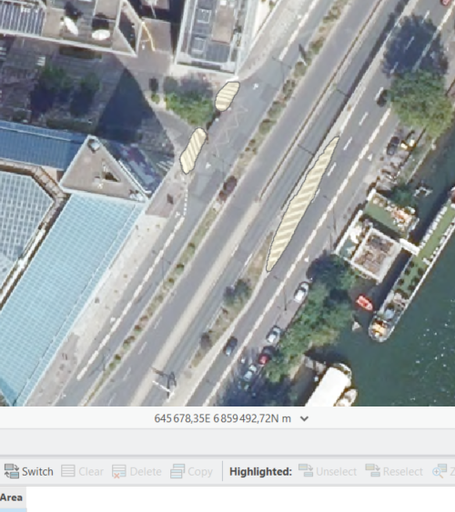
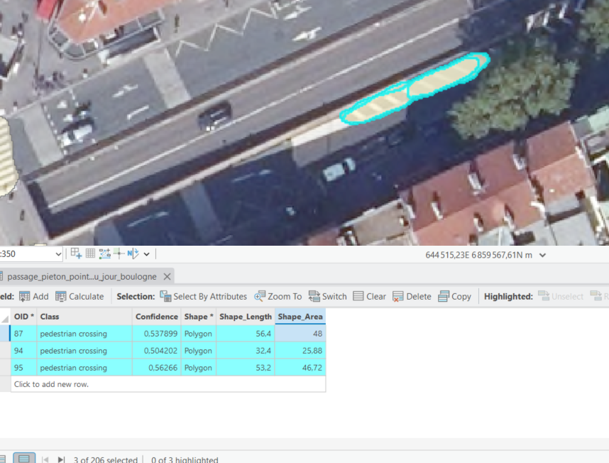

# 03 — Pré-annotation assistée par IA (SAM 3)

Pour accélérer la constitution de la vérité terrain sur l'ensemble du territoire, nous avons utilisé un modèle de fondation de segmentation d'images (*Segment Anything Model* - version SAM 3) exécuté directement dans l'environnement Deep Learning d'ArcGIS Pro.

---

## 1. Paramétrage de l'inférence (`Detect Objects Using Deep Learning`)

- **Outil** : `Detect Objects Using Deep Learning` (Image Analyst Tools).
- **Raster d'entrée** : `ortho_gpso_brut_Clip`.
- **Modèle Deep Learning** : `SAM3.dlpk` (paquetage de modèle ESRI).
- **Couche d'objets détectés en sortie** : `Default.gdb\passages_pietons`.
- **Arguments d'inférence** :
  ```
  text_prompt 'pedestrian crossing';padding 64;batch_size 2;box_nms_thresh 0,5;points_per_batch 64;stability_score_thresh 0,5;min_mask_region_area 0
  ```
- **Options géospatiales** :
  - `Non Maximum Suppression (NMS)` : `NO_NMS` (pour éviter de supprimer des passages proches).
  - `Processing Mode` : `PROCESS_AS_MOSAICKED_IMAGE`.
  - `Use pixel space` : `NO_PIXELSPACE` (travail en coordonnées cartographiques Lambert-93).
- **Temps d'exécution** : 2 minutes 59 secondes sur le premier secteur test.

---

## 2. Analyse des forces et limites de la pré-annotation SAM 3

SAM 3 avec le prompt textuel `"pedestrian crossing"` parvient à détecter une majorité d'objets sans aucun entraînement préalable sur le territoire (*zero-shot inference*), mais génère des erreurs caractéristiques :

### ✅ Ce que SAM 3 réussit bien :
- Détection des passages standards situés sur des chaussées dégagées et bien éclairées.
- Délimitation globale des contours rectangulaires des rayures.


*Figure 1 : Exemple d'un passage piéton standard correctement détouré par SAM 3 (Score de confiance : 0,51).*


*Figure 2 : Détection réussie d'un passage piéton en abord d'un rond-point.*

---

### ⚠️ Ce qui met SAM 3 en échec (Nécessité de correction humaine) :

1. **Zones d'ombre forte & Occlusions** : Sous les ombres franches ou les véhicules, SAM ne capture que la partie ensoleillée ou contourne le véhicule.


*Figure 3 : Omission partielle due à l'ombre d'arbres et à la présence d'un véhicule.*


*Figure 4 : Déformation du contour causée par un véhicule en stationnement.*


*Figure 5 : Seule la moitié ensoleillée du passage est capturée par SAM 3.*


*Figure 6 : Perte de contraste en limite d'ombre portée de bâtiment.*

2. **Confusions de marquage au sol (Faux positifs)** : SAM 3 confond régulièrement les chevrons et zébras de canalisation routière avec des passages piétons.


*Figure 5 : Faux positif majeur — SAM 3 prend une bande de séparation de voies pour un passage piéton.*


*Figure 6 : Faux positif sur des chevrons de bifurcation routière.*

> 📌 **Bilan** : SAM 3 fournit un excellent canevas de départ, mais ne peut en aucun cas être utilisé brut comme vérité terrain. Une phase rigoureuse d'audit et de correction manuelle est indispensable.
