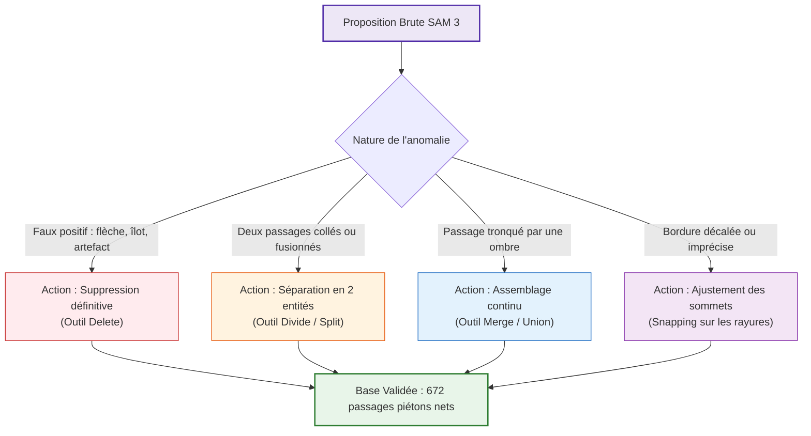
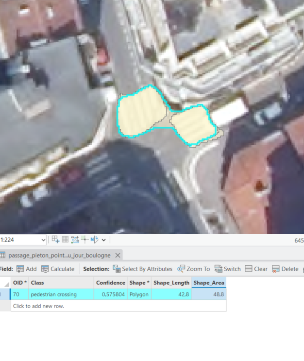
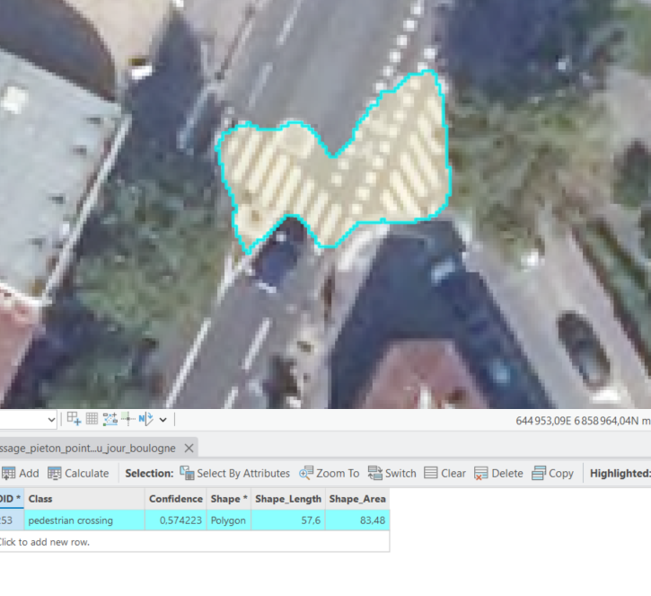
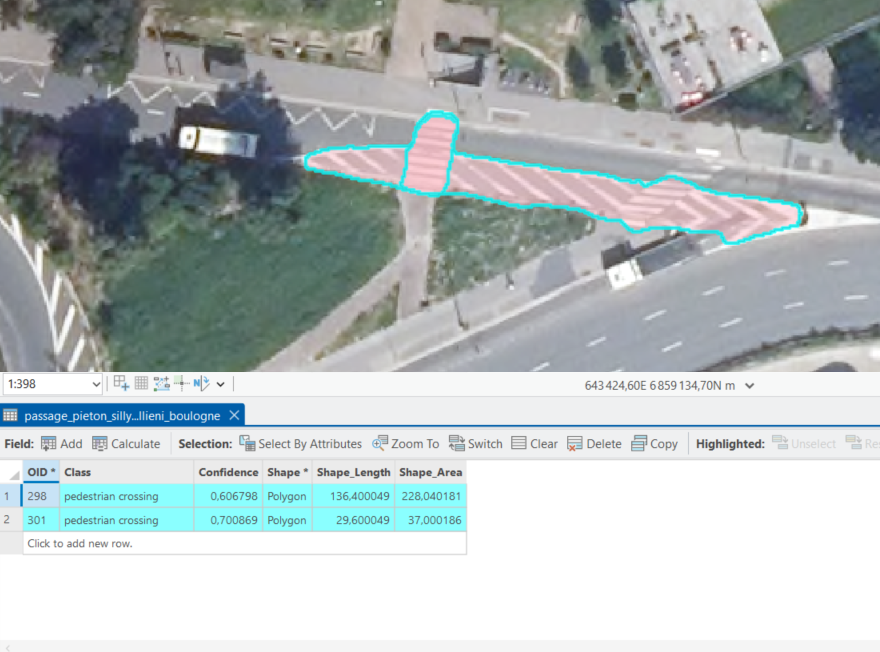
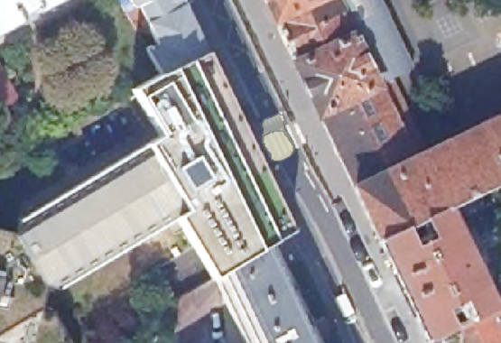
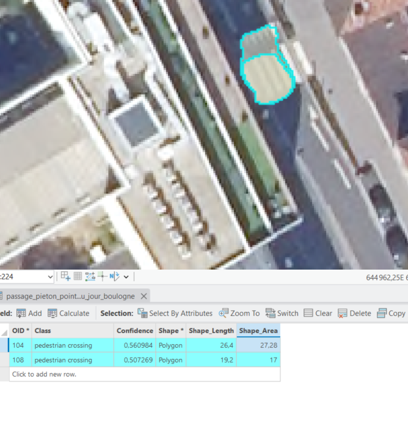
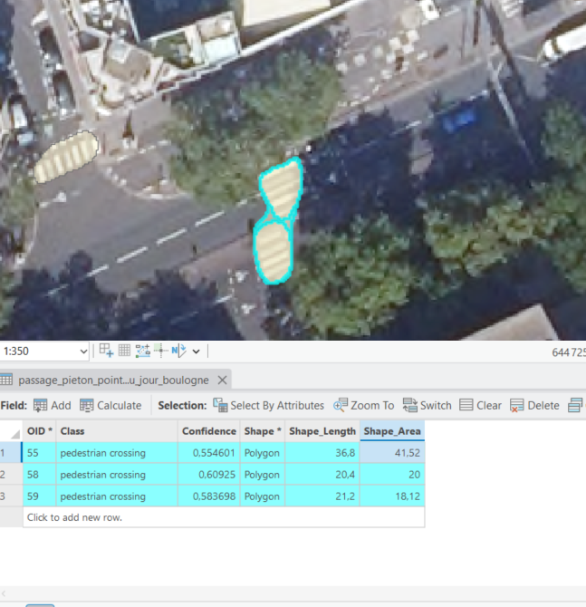
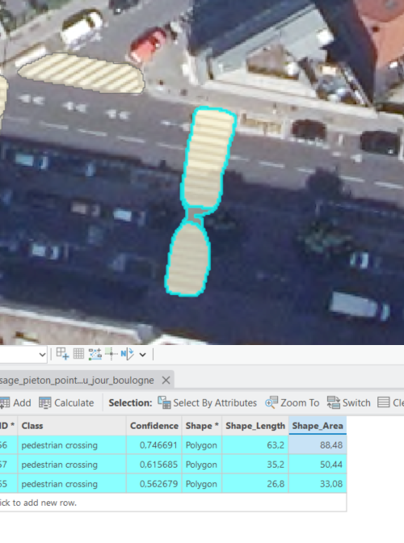
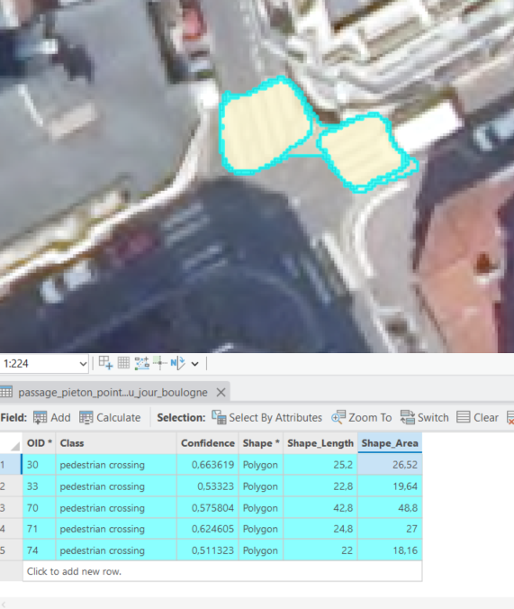

# 04 — Protocole de correction manuelle & nettoyage expert sous SIG

Pour obtenir une vérité terrain (*Ground Truth*) irréprochable, l'ensemble des propositions de SAM 3 a été inspecté et corrigé visuellement sous SIG par un opérateur humain.

---

## 1. Méthode et règles d'édition topologique

Chaque proposition brute a été soumise à un protocole systématique :

1. **Suppression des faux positifs (`Delete`)** :
   - Élimination des flèches directionnelles, zébras de stationnement, îlots directionnels et marquages provisoires de travaux.
2. **Division des passages fusionnés (`Divide / Split Tool`)** :
   - Quand deux passages piétons distincts situés à moins de 2 mètres ont été englobés dans un unique polygone par SAM, ils ont été scindés en **deux entités distinctes**.

*Figure 1 : Deux passages piétons distincts au carrefour fusionnés en un seul polygone (OID 70) — corrigé avec l'outil Divide.*

*Figure 2 : Cas complexe où SAM a fusionné 3 traversées piétonnes et cyclables en une entité géante de 83,5 m².*

*Figure 3 : Passage piéton fusionné avec un chevron autoroutier (OID 298 de 228 m²) — scindé par Divide puis suppression du chevron.*

3. **Fusion des fragments (`Merge / Union Tool`)** :
   - Quand l'ombre d'un candélabre ou d'un immeuble a sectionné un passage piéton en deux sous-polygones, les entités ont été fusionnées en **un polygone continu**.

*Figure 4 : Rue canyon où l'ombre portée d'un bâtiment coupe un passage piéton en deux.*

*Figure 5 : Zoom sur les deux polygones disjoints (OID 104 & 108) — assemblés en une seule entité par l'outil Merge.*

*Figure 6 : Autre cas de fragmentation sous le feuillage d'un arbre.*

4. **Recalage fin des contours & Audit des attributs** :
   - Ajustement des sommets pour caler le polygone sur l'empreinte exacte des bandes blanches peintes sur la chaussée.

*Figure 7 : Découpage propre d'un passage piéton traversant scindé par un îlot refuge central.*

*Figure 8 : Contrôle systématique des polygones et des surfaces dans la table attributaire.*

---

## 2. Décompte quantitatif des annotations validées

Sur le premier quartier pilote, la correction humaine a fait passer le jeu d'entités de **244 propositions brutes à 215 passages piétons vérifiés**.

La campagne d'annotation sur l'ensemble des quartiers du territoire a produit la série suivante :

| Quartier / Secteur | Entités validées | Description |
|---|---|---|
| Quartier 1 (Pilote) | **215** | Secteur urbain dense (Boulogne Nord / Centre) |
| Quartier 2 | **178** | Secteur mixte commercial et résidentiel (Boulogne Sud) |
| Quartier 3 | **125** | Secteur Est (Issy-les-Moulineaux / Vanves) |
| Quartier 4 | **107** | Secteur Sud (Meudon centre / plateau) |
| Quartier 5 | **36** | Secteur Ouest (Sèvres / Chaville) |
| Quartier 6 | **11** | Secteur boisé et limites périurbaines |
| **TOTAL GÉNÉRAL** | **672 passages piétons** | **Couche vectorielle `passages_pietons_all`** |

---

## 3. Règle de classification
Toutes les entités validées ont été affectées à une classe unique :
- **Nom de classe** : `Undefined` (ou `pedestrian_crossing`).
- **Valeur numérique raster** : `1` (positive).
- **Valeur de fond** : `0` (négative / NoData / chaussée).
