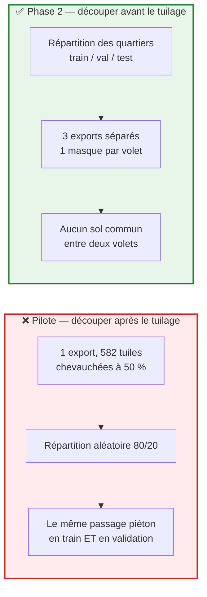
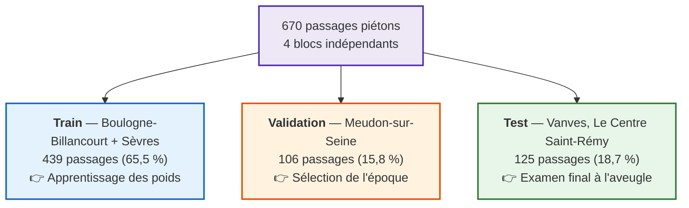

# 06 — Découpage train / validation / test par blocs géographiques

> **Statut** : Exécuté le 24 août 2026. Trois jeux produits, étanchéité vérifiée par le calcul.
> **Produit** : `tiles_train/` (397 tuiles), `tiles_val/` (88 tuiles), `tiles_test/` (101 tuiles).

---

## 🎯 Pourquoi une étape de plus après le tuilage

Le chapitre [`05`](05_tuilage_export_tiles.md) produit **un seul lot** de 582 tuiles, exportées avec un pas de 256 px. Le pilote a ensuite réparti ces tuiles en train/validation **au hasard**, après coup.

C'est cet ordre des opérations qui a produit la fuite spatiale documentée en [Phase 1](../03_phase_1_experience_pilote/02_decouverte_fuite_spatiale.md).

Une tuile fait $512$ px ($102,4$ m) et le pas d'échantillonnage est de $256$ px ($51,2$ m) : **deux tuiles voisines partagent la moitié de leur sol**. Une fois l'export terminé, le mélange est inscrit dans les fichiers et aucun traitement postérieur ne peut le défaire.

Le chiffre qui le résume : le territoire porte **670 passages piétons annotés**, mais les 582 tuiles en contiennent **1 691 occurrences** — chaque passage est présent 2,5 fois en moyenne, sur des tuiles différentes.



**Principe retenu : le découpage est une opération SIG sur la géométrie du terrain, réalisée avant le tuilage — pas un tri de fichiers réalisé après.**

---

## 🗺️ L'unité de découpage : le quartier annoté

L'annotation ayant été menée quartier par quartier (chapitre [`04`](04_correction_manuelle_expert.md)), chaque polygone de `passages_pietons_all` porte déjà son attribut `nom_quartier`, et la couche `couche_quartier` en délimite l'emprise. Aucune couche supplémentaire n'a été nécessaire.

| Quartier | Commune | Passages |
|---|---|---|
| Silly - Galliéni | Boulogne-Billancourt | 214 |
| République - Point-du-Jour | Boulogne-Billancourt | 178 |
| Le Centre Saint-Rémy | Vanves | 125 |
| Meudon-sur-Seine | Meudon | 106 |
| Garenne - Rive Gauche | Sèvres | 36 |
| Gabriel Péri - Danton | Sèvres | 11 |
| **Total** | | **670** |

Deux quartiers d'une même commune étant mitoyens, ils ne peuvent pas être séparés sans ménager un corridor tampon. Les six quartiers se ramènent donc à **quatre blocs réellement indépendants** :

$$\text{BB} = 392 \quad|\quad \text{VAN} = 125 \quad|\quad \text{MEU} = 106 \quad|\quad \text{SEV} = 47$$

---

## ⚖️ Répartition retenue



Justification des trois choix :

- **Le test est une commune entière jamais vue.** Vanves n'est mitoyenne ni de Boulogne (Issy s'intercale) ni de Meudon (Clamart s'intercale). Aucun contact avec le train, donc aucun corridor tampon à creuser et aucune donnée sacrifiée.
- **Sèvres part au train.** Avec 47 passages, le bloc SEV est trop petit pour évaluer quoi que ce soit ; il sert mieux à diversifier l'apprentissage, qui couvre ainsi deux communes et les deux rives de la Seine.
- **Le ratio 65 / 16 / 19** reste proche d'un 70/15/15 classique sans qu'aucun quartier ait eu à être coupé en deux.

---

## ⚙️ Les trois exports

Le découpage s'obtient en relançant **trois fois** `Export Training Data For Deep Learning`, en ne faisant varier que le masque et le dossier de sortie.

Sélection de la zone, sur `couche_quartier` :

```sql
-- train
nom_quartier IN ('Silly - Galliéni - BB', 'République - Point-du-Jour - BB',
                 'Garenne - Rive Gauche - SEV', 'Gabriel Péri - Danton - SEV')
-- val
nom_quartier = 'Meudon-sur-Seine - MEU'
-- test
nom_quartier = 'Le Centre Saint-Rémy - VAN'
```

Paramètres, identiques aux trois runs et repris du pilote pour rester comparable :

| Paramètre | Valeur | Rôle |
|---|---|---|
| `Input Raster` | `ortho_gpso_brut_Clip` | Ortho mosaïquée et découpée (chapitre 02) |
| `Input Feature Class` | `passages_pietons_all` | Les 670 passages validés (chapitre 04) |
| **`Input Mask Polygons`** | **`couche_quartier` (sélection)** | **Le paramètre qui produit l'étanchéité** |
| `Tile Size X / Y` | `512 / 512` | $102,4$ m de côté, identique au pilote |
| `Stride X / Y` | `256 / 256` | Pas d'échantillonnage, identique au pilote |
| `Metadata Format` | `Classified_Tiles` | Masques raster — segmentation, pas détection d'objet |
| `Crop Mode` | `FIXED_SIZE` | Tuiles de taille constante |
| `Reference System` | `MAP_SPACE` | Coordonnées métriques Lambert-93 |
| `Output No Feature Tiles` | `ONLY_TILES_WITH_FEATURES` | ⚠️ voir *Limites* |
| `Buffer Radius` / `Rotation Angle` | `0` / `0` | |

> 🔑 **`Input Mask Polygons` ne génère que les tuiles entièrement contenues dans le polygone.** C'est de là que vient l'étanchéité : une tuile ne peut pas déborder sur le quartier voisin. Le corridor tampon envisagé au départ s'est révélé inutile (voir la vérification ci-dessous).

---

## 📊 Résultat des trois exports

| Volet | Tuiles | Occurrences | Passages réels | Répétition | Occ./tuile | Aire moyenne |
|---|---|---|---|---|---|---|
| `tiles_train` | 397 | 1 144 | 439 | 2,61 | 2,88 | 24,97 m² |
| `tiles_val` | 88 | 200 | 106 | 1,89 | 2,27 | 24,54 m² |
| `tiles_test` | 101 | 354 | 125 | 2,83 | 3,50 | 24,13 m² |
| **Total** | **586** | **1 698** | **670** | | | |

Le pilote produisait 582 tuiles et 1 691 occurrences : **le découpage n'a rien fait perdre**. Les 4 tuiles d'écart viennent du décalage de la grille de tuilage lorsque l'emprise d'export change.

L'aire moyenne des objets reste stable d'un volet à l'autre ($24,1$ à $25,0$ m²), signe que les trois volets décrivent bien le même type d'objet.

L'écart de répétition entre val ($1,89$) et test ($2,83$) tient à la forme des quartiers : Meudon-sur-Seine est une bande étroite en bord de Seine, donc beaucoup de ses passages sont proches d'un bord et moins de leurs quatre tuiles candidates tiennent entièrement dans le quartier. Le Centre Saint-Rémy est un quartier compact, où ce phénomène est marginal.

---

## 🛡️ Vérification de l'étanchéité

L'étanchéité a été **mesurée**, pas supposée, à partir des coordonnées Lambert-93 portées par les fichiers de calage `.tfw` de chaque tuile.

Le regroupement des 582 tuiles du pilote en composantes connexes par recouvrement donne **15 amas disjoints**, qui se répartissent exactement selon les quartiers : 393 tuiles pour les quartiers de train, 88 pour Meudon, 101 pour Vanves. Ces valeurs, obtenues indépendamment de l'export, coïncident avec les 397 / 88 / 101 effectivement produits.

| Paire de volets | Tuiles qui se recouvrent | Distance minimale |
|---|---|---|
| train ↔ val | **0** | **778 m** |
| train ↔ test | **0** | **1 694 m** |
| val ↔ test | **0** | **2 452 m** |

**Aucune paire de tuiles de deux volets différents ne partage le moindre mètre carré**, et les corridors naturels entre quartiers vont de 778 m à 2,4 km. La tuile d'entraînement la plus proche du test se trouve à 1,7 km de Vanves.

---

## ⚠️ Écueil rencontré : le pas de 512 px

Une première tentative a exporté la validation avec un pas de $512$ px, pour supprimer tout chevauchement à l'intérieur du volet et éviter que le même passage soit compté plusieurs fois lors de l'évaluation.

**Résultat : 21 tuiles et 53 passages sur les 106 de Meudon — la moitié du jeu de validation perdue.**

La cause tient à l'interaction entre le pas et le masque. `Input Mask Polygons` ne conserve que les tuiles entièrement contenues dans le quartier :

- à un pas de $256$ px, un passage tombe dans **4 tuiles candidates** ; il suffit qu'une seule tienne entièrement dans le quartier pour qu'il soit conservé ;
- à un pas de $512$ px, il n'en reste qu'**une seule** ; si elle déborde, le passage disparaît du jeu de données.

Meudon-sur-Seine étant une bande étroite, presque toutes les cellules d'une grille de $102$ m touchent une frontière — d'où l'ampleur de la casse.

**Décision** : pas de $256$ px sur les trois volets. Le double comptage n'est pas traité à l'export mais **à l'évaluation**, en recollant les prédictions sur le territoire en Lambert-93 grâce aux `.tfw` et en les confrontant aux polygones de référence. Chaque passage piéton compte alors pour un objet, qu'il apparaisse sur une ou quatre tuiles. Supprimer la redondance dans les fichiers coûtait la moitié des objets ; la supprimer au moment de la mesure ne coûte rien.

---

## 📌 Limites assumées

1. **Le test repose sur une seule commune.** Avec quatre blocs indépendants seulement, le volet de test ne peut couvrir qu'un territoire. Les chiffres publiés répondront à « le modèle transfère-t-il à Vanves », et non « à une commune quelconque ». La conclusion doit être formulée en ces termes.
2. **Aucune tuile négative.** `ONLY_TILES_WITH_FEATURES` fait que les 586 tuiles contiennent toutes au moins un passage piéton : le modèle ne verra jamais une rue vide, un parking ou une toiture. La précision objet mesurée sur ce jeu sera donc optimiste par rapport à une inférence sur l'ensemble du territoire. **Point ouvert, à trancher avant l'évaluation finale.**

---

## 🔧 Note technique pour les dataloaders

Les masques de `labels/` sont écrits par ArcGIS en **entiers non signés sur 16 bits** (`BitsPerSample = 16`, une seule bande), alors que les images de `images/` sont en 8 bits sur trois bandes. Un lecteur qui suppose du 8 bits partout obtient un masque étiré d'un facteur 2 et décalé — l'erreur est silencieuse et ne provoque aucune exception. Les valeurs utiles restent $\{0, 1\}$.
