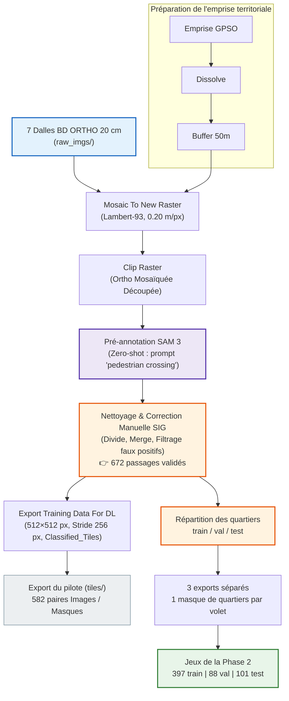

# Chaîne d'acquisition et préparation des données : de `raw_imgs/` à `tiles/`

Ce dossier documente de manière exhaustive, reproductible et définitive l'ensemble de la chaîne de traitement géospatial et d'annotation ayant permis de transformer les 7 dalles brutes d'orthophotographies aériennes en un jeu de données de 582 vignettes d'apprentissage pour le Deep Learning.

---

## 🗺️ Schéma global du flux de données

> Les deux branches partent du même jeu d'annotations validées. La branche grise est celle du **pilote** (un export unique, découpé après coup — d'où la fuite spatiale). La branche verte est celle de la **Phase 2** : la répartition géographique précède le tuilage, ce qui rend la fuite structurellement impossible.

---

## 📚 Guide des chapitres

| Chapitre | Titre | Description |
|---|---|---|
| [`01_selection_ortho_ign.md`](01_selection_ortho_ign.md) | **Sélection & Caractéristiques des Orthophotos IGN** | Les 7 dalles BD ORTHO 2024, système Lambert-93, justification physique de la résolution 20 cm. |
| [`02_traitements_sig_arcgis.md`](02_traitements_sig_arcgis.md) | **Traitements Géospatiaux sous ArcGIS Pro** | Dissolve, Buffer 50 m, Mosaic To New Raster et Clip Raster. |
| [`03_pre_annotation_sam3.md`](03_pre_annotation_sam3.md) | **Pré-annotation assistée par IA (SAM 3)** | Utilisation du modèle de fondation SAM 3 zero-shot et analyse des premières détections. |
| [`04_correction_manuelle_expert.md`](04_correction_manuelle_expert.md) | **Protocole de Correction & Nettoyage SIG** | Opérations topologiques (`Divide`, `Merge`), suppression des faux positifs, décompte des 672 objets. |
| [`05_tuilage_export_tiles.md`](05_tuilage_export_tiles.md) | **Génération des Vignettes & Structure `tiles/`** | Export en tuiles 512×512, pas de 256 px, formats raster et métadonnées géoréférencées. *(export du pilote)* |
| [`06_decoupage_train_val_test.md`](06_decoupage_train_val_test.md) | **Découpage train / val / test par blocs géographiques** | Répartition des quartiers avant tuilage, trois exports séparés, étanchéité vérifiée par le calcul (0 recouvrement, corridors de 778 m à 2,4 km). |

---

## 📦 Résumé des données produites

**Jeux de la Phase 2** — trois lots spatialement étanches, produits par le chapitre [`06`](06_decoupage_train_val_test.md) :

| Dossier | Territoire | Tuiles | Passages piétons |
|---|---|---|---|
| `tiles_train/` | Boulogne-Billancourt + Sèvres | 397 | 439 |
| `tiles_val/` | Meudon-sur-Seine | 88 | 106 |
| `tiles_test/` | Vanves (Le Centre Saint-Rémy) | 101 | 125 |

Aucune tuile de deux volets différents ne partage le moindre mètre carré ; les corridors entre volets vont de 778 m à 2,4 km.

**Export du pilote** — [`tiles/`](../../datasets/tiles/), conservé comme archive de la Phase 1 : 582 vignettes chevauchées à 50 %, non découpées en volets.

**Caractéristiques communes à tous les lots** :
- **Images** (`images/*.tif` + `.tfw`) : RVB, 8 bits non signé, $512 \times 512$ pixels.
- **Masques** (`labels/*.tif` + `.tfw`) : une bande, **16 bits non signé**, valeurs $\{0 = \text{Fond},\ 1 = \text{Passage piéton}\}$.
- **Résolution spatiale** : $0,20\text{ m}$ par pixel ($102,4\text{ m} \times 102,4\text{ m}$ par vignette), Lambert-93 / EPSG:2154.
- **Proportion de pixels positifs** : $0,6725\ \%$ — classe rare, d'où le rejet de l'*accuracy* au pixel (voir [`01_cadrage_et_metriques`](../01_cadrage_et_metriques/01_importance_des_metriques.md)).
