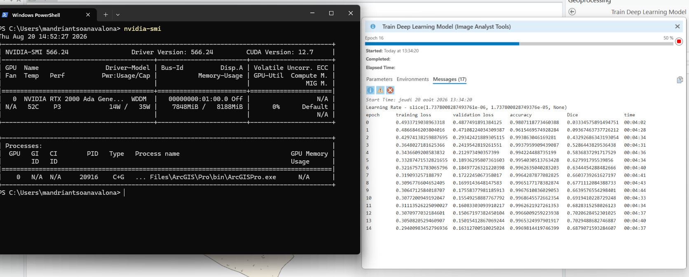
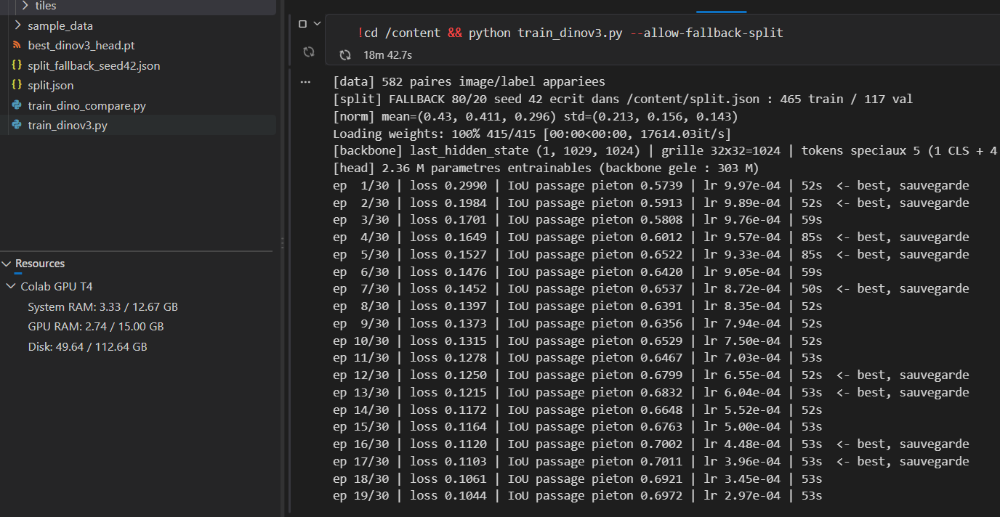

# 01 — Duel des architectures initial : Baseline U-Net vs DINOv3 gelé

## 🎯 Problématique de la Phase 1
Est-il préférable d'entraîner entièrement un U-Net classique sur nos données territoriales ou d'exploiter les représentations pré-entraînées d'un modèle de fondation satellite en gelant son réseau dorsal (*frozen backbone*) ?

---

## 🏗️ Schéma des deux paradigmes testés

```mermaid
flowchart TD
    subgraph S1 ["Approche 1 : Baseline U-Net ResNet34 (ArcGIS)"]
        direction LR
        I1["Image 512×512"] --> E1["ResNet34 Encodeur<br>(Fine-tuné)"] --> D1["Décodeur U-Net<br>(Fine-tuné)"] --> M1["Masque Binaire"]
        style E1 fill:#ffebee,stroke:#c62828,stroke-width:2px
        style D1 fill:#ffebee,stroke:#c62828,stroke-width:2px
    end

    subgraph S2 ["Approche 2 : DINOv3 ViT-L/16 SAT-493M (Fondation)"]
        direction LR
        I2["Image 512×512"] --> B2["ViT-L/16 GELÉ<br>(304 M param - 0 gradient)"] --> H2["Tête Conv 2 couches<br>(2,36 M param entraînés)"] --> M2["Masque Binaire"]
        style B2 fill:#e8f5e9,stroke:#2e7d32,stroke-width:2px
        style H2 fill:#e3f2fd,stroke:#1565c0,stroke-width:2px
    end
```

---

## 📊 Résultats du benchmark comparatif (Validation initiale - 117 tuiles)

| Métrique | Baseline U-Net ResNet34 | DINOv3 ViT-L/16 (Gelé) | Avantage DINOv3 |
|---|---|---|---|
| **Qualité du contour (IoU)** | 0,6634 | **0,7252** | **+0,0618 (+9,3 %)** |
| **Score Dice / F1-Pixel** | 0,7976 | **0,8407** | **+0,0431** |
| **Précision Pixel** | 0,7908 | **0,8083** | **+0,0175** |
| **Rappel Pixel** | 0,8045 | **0,8759** | **+0,0714 (+8,9 %)** |
| **Détection d'objet (> 50 %)** | 79,5 % (248/312) | **88,1 % (275/312)** | **+8,6 points (+27 objets trouvés)** |
| **Score avec TTA D4** | 0,6981 | **0,7404** | **+0,0423** |
| **Paramètres à entraîner** | 41 100 000 | **2 360 000** | **÷ 17 (94 % de poids en moins)** |
| **Temps par époque GPU** | ~4 min 35 s | **~1 min 40 s** | **÷ 2,8 plus rapide** |

*Intervalles de confiance à 95 % disjoints : DINOv3 [0,7087 – 0,7397] vs ResNet34 [0,6377 – 0,6845].*

---

## 🖥️ Traces et télémétrie GPU réelles

### 1. Entraînement U-Net sous ArcGIS Pro (GPU RTX 2000 Ada)
L'entraînement du U-Net mobilise les gradients sur les 41,1 M de paramètres :
- **Mémoire GPU (VRAM)** : **7 848 MiB / 8 188 MiB (96 % de saturation)**.
- **Temps par époque** : ~04:35 min.

*Figure 1 : Moniteur ArcGIS Pro et télémétrie nvidia-smi montrant la saturation de la VRAM.*

### 2. Entraînement DINOv3 sous Google Colab (GPU T4)
Avec son réseau dorsal gelé, seules les convolutions de la tête sont optimisées :
- **Mémoire GPU (VRAM)** : **2,74 Go / 15,00 Go (18 % seulement)**.
- **Temps par époque** : **52 à 85 secondes**.

*Figure 2 : Sortie console de train_dinov3.py sur GPU T4 montrant la progression de l'IoU dès l'époque 1.*

---

## 🔍 Analyse des typologies d'erreurs

1. **Vitesse de convergence** : Dès l'époque 1, DINOv3 atteint un IoU de 0,57 (score que le U-Net met 10 époques à approcher).
2. **Localisation des erreurs** :
   - **DINOv3** : $70,6\ \%$ des erreurs sont situées sur le liséré extérieur du contour (1-2 pixels), lié à la discrétisation par patchs de $16 \times 16$ px du transformeur.
   - **U-Net** : $41,0\ \%$ des erreurs sont des omissions franches ou des faux positifs diffus éloignés des vrais passages.
3. **Cas d'échec francs (12 tuiles)** : 100 % correspondent à des passages coupés par le bord de tuile (artefact de tuilage sur lequel les deux modèles échouent identiquement).
