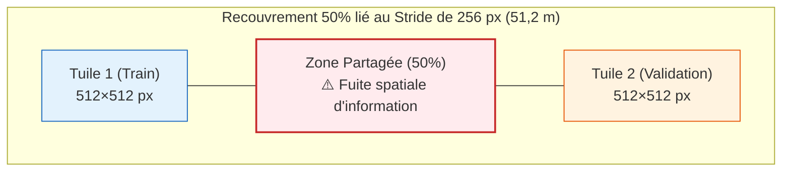

# 02 — Découverte de la fuite spatiale : limites de la Phase 1

## 🎯 Problématique
Pourquoi les scores de la Phase 1 (IoU 0,725 et 0,663), bien qu'indicatifs de la hiérarchie des modèles, ne peuvent pas être considérés comme des résultats scientifiques définitifs ?

---

## 🔍 Le piège du tuilage avec recouvrement (Stride 256 px)

Lors de l'export initial des données sous ArcGIS Pro, un paramètre géométrique a créé un biais d'évaluation majeur :
- **Taille de tuile** : $512 \times 512$ pixels ($102,4\text{ m} \times 102,4\text{ m}$).
- **Stride (pas)** : $256 \times 256$ pixels ($51,2\text{ m} \times 51,2\text{ m}$).

En appliquant un découpage aléatoire 80/20 (`split.json` v1) :
- Une tuile attribuée à la validation partage $50\ \%$ de son sol avec chaque tuile contiguë d'entraînement.
- Le modèle est entraîné sur une portion de route et testé sur la même portion vue avec un décalage de 51 mètres.

---

## 📊 Chiffrage géométrique de la contamination

L'audit spatial exact (`verif_recouvrement.py`) donne les résultats suivants :
- **Part du sol d'une tuile de validation déjà vue à l'entraînement** : **Moyenne : 84,0 %** (Médiane : 100 %).
- **Tuiles de validation à 100 % déjà apprises** : **66 / 117**.
- **Tuiles de validation réellement inédites** : **2 / 117 seulement**.

---

## 📌 Conclusion & Conséquence pour la suite

1. **Les scores de la Phase 1 sont sur-évalués** pour les deux modèles par rapport à ce qu'ils donneraient sur une nouvelle ville entièrement inconnue.
2. **DINOv3 reste le meilleur candidat** : ayant été évalué sur les mêmes tuiles que le U-Net (qui bénéficiait en plus d'une contamination inconnue issue d'ArcGIS), son avantage comparatif demeure indiscutable.
3. **Le passage obligatoire à la Phase 2** : Pour publier des chiffres définitifs et fiables, l'entraînement et l'évaluation doivent être rejoués sur un **découpage par blocs géographiques étanches (0 % de fuite)**.
