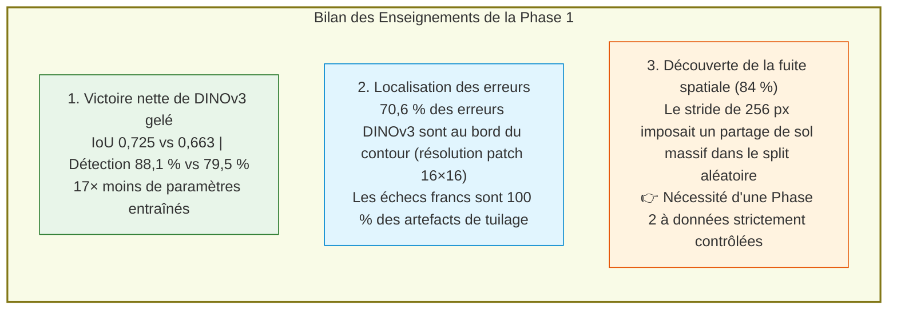

# Phase 1 : Expérience pilote de faisabilité & enseignements clés

> **Statut** : Phase exploratoire initiale achevée.  
> **Rôle** : Évaluer la faisabilité technique de la segmentation sur orthophoto 20 cm et comparer deux paradigmes d'IA (fine-tuning complet vs modèle de fondation gelé).

---

## 🎯 Ce qui a été testé en Phase 1

Nous avons confronté deux approches sur les 582 vignettes de $512 \times 512$ pixels :
1. **La baseline standard SIG** : Un réseau **U-Net ResNet34** entraîné entièrement sous ArcGIS Pro (41,1 millions de paramètres fine-tunés).
2. **Le modèle de fondation satellite** : **DINOv3 ViT-L/16 SAT-493M**, dont le réseau dorsal de 304 M paramètres est **gelé à 100 %**, associé à une tête de convolution légère de 2 couches (2,36 millions de paramètres entraînés).

---

## ⚡ Les 3 résultats essentiels à retenir

---

## 📚 Documents de la Phase 1

- [`01_duel_architectures_initial.md`](01_duel_architectures_initial.md) : Détail du benchmark comparatif, télémétrie d'entraînement GPU et analyse qualitative.
- [`02_decouverte_fuite_spatiale.md`](02_decouverte_fuite_spatiale.md) : Démonstration de la fuite spatiale de 84 % et pourquoi la Phase 1 ne peut servir de verdict définitif.

---

## 🚀 Transition vers la Phase 2
La Phase 1 a prouvé la supériorité architecturale de DINOv3 mais a révélé la fragilité méthodologique du split aléatoire.
**La vraie expérience scientifique commence en Phase 2 sur des données spatiales strictement contrôlées (0 % de fuite).**
