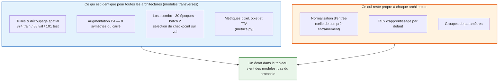
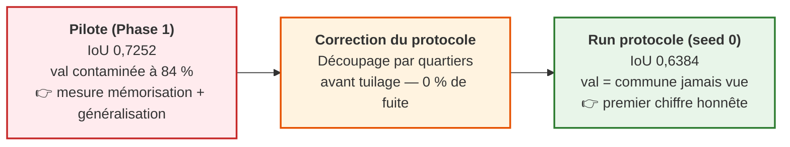

# Benchmark des architectures sur données spatialement étanches

> ⚠️ **DRAFT** — document de travail du 25 août 2026. Seule la partie **DINOv3** repose sur un run achevé. La colonne U-Net ResNet34 est vide : son entraînement sous le protocole commun **n'a pas encore été lancé**. Aucun chiffre ne doit être cité hors du dépôt tant que ce bandeau est présent.

---

## 🎯 Objet de ce dossier

La [Phase 1](../03_phase_1_experience_pilote/README.md) a comparé deux architectures sur un découpage qui **fuyait à 84 %** : une tuile de validation partageait en moyenne 84 % de son sol avec les tuiles d'entraînement. Les scores publiés alors (IoU 0,725 pour DINOv3, 0,663 pour le U-Net) mesuraient donc autant la mémorisation que la généralisation.

Ce dossier rassemble les **bilans de run obtenus sous le protocole à blocs étanches** du chapitre [`02/06`](../02_acquisition_de_donnees/06_decoupage_train_val_test.md) : entraînement à Boulogne-Billancourt et Sèvres, sélection de l'époque à Meudon-sur-Seine, examen final à Vanves — **0 % de sol commun entre volets, corridors de 778 m à 2,4 km**.

Un chapitre par architecture, tous mesurés avec le même code, les mêmes tuiles et les mêmes métriques.

---

## 🧪 Le protocole commun aux architectures

> 🔒 **Le volet test (101 tuiles, Vanves) n'a jamais été ouvert.** Aucune commande d'évaluation n'a été lancée dessus, et `train.py` ne le lit à aucun moment. Il sera ouvert **une seule fois**, après que l'architecture et l'époque auront été figées sur val. Tous les chiffres de ce dossier sont donc des chiffres de **validation**, pas de généralisation.

---

## 📊 Tableau comparatif — état au 25 août 2026

Volet de validation : 88 tuiles de Meudon-sur-Seine, 189 occurrences d'objets, seuil de décision 0,5.

| Métrique (volet val) | **DINOv3 ViT-L/16 gelé** | **U-Net ResNet34** | Rappel du pilote (fuité) |
|---|---|---|---|
| **IoU passage piéton** | **0,6384** | _à compléter — entraînement non lancé_ | 0,7252 / 0,6634 |
| IC 95 % de l'IoU | [0,6127 – 0,6637] | _à compléter_ | [0,7087 – 0,7397] / [0,6377 – 0,6845] |
| Dice / F1-pixel | 0,7793 | _à compléter_ | 0,8407 / 0,7976 |
| Précision pixel | 0,7487 | _à compléter_ | 0,8083 / 0,7908 |
| Rappel pixel | 0,8125 | _à compléter_ | 0,8759 / 0,8045 |
| **Détection d'objet (> 50 %)** | **87,3 %** (165/189) | _à compléter_ | 88,1 % / 79,5 % |
| IoU avec TTA D4 | 0,6579 | _à compléter_ | 0,7404 / 0,6981 |
| Détection d'objet avec TTA D4 | 85,7 % (162/189) | _à compléter_ | — |
| Paramètres entraînés | 2,36 M (backbone gelé 304 M) | 41,1 M *(pilote ArcGIS)* | — |
| Époque retenue sur val | 18 / 30 | _à compléter_ | — |
| Durée du run | ~3 h 54 (30 époques, `mps`) | _à compléter_ | — |
| Graines exécutées | 1 (seed 0) | _à compléter_ | 1 |
| **Erreur de centroïde (< 1,5 m)** | _non mesurée_ | _non mesurée_ | _non mesurée_ |
| **Erreur de comptage (MAE)** | _non mesurée_ | _non mesurée_ | _non mesurée_ |

> Les deux dernières lignes sont les métriques cardinales du [cadrage](../01_cadrage_et_metriques/01_importance_des_metriques.md). **Aucune architecture n'a encore de chiffre dessus** : elles supposent le recollage des prédictions en Lambert-93 et la vectorisation ponctuelle, qui restent à écrire. Le benchmark actuel se juge donc sur des métriques intermédiaires.

---

## 📉 Le message central : 0,725 → 0,638 n'est pas une régression

Le modèle n'a pas empiré : **la mesure s'est assainie**. Les 0,0868 points d'IoU perdus (−12,0 % en relatif) sont la part du score du pilote qui venait du sol déjà vu à l'entraînement. Le 0,6384 est le premier chiffre du projet qui décrive ce que le modèle fait sur un territoire inconnu.

Détail notable, et à confirmer : la métrique métier a bien moins bougé que la métrique pixel — **88,1 % → 87,3 % de détection d'objet, soit 0,8 point**, contre 12 % de baisse relative sur l'IoU. Les deux jeux de validation n'étant pas les mêmes (312 occurrences sur 117 tuiles au pilote, 189 sur 88 tuiles ici), la comparaison n'est pas stricte ; elle suggère néanmoins que la fuite spatiale gonflait surtout la finesse des contours, pas la capacité à voir un passage piéton.

---

## 📚 Chapitres

| Chapitre | Architecture | État |
|---|---|---|
| [`01_bilan_dinov3.md`](01_bilan_dinov3.md) | **DINOv3 ViT-L/16 SAT-493M gelé + tête conv** | ✅ Run achevé (seed 0), bilan rédigé — DRAFT |
| `02_bilan_unet_resnet34.md` | **U-Net ResNet34 (recette `protocole`)** | ⏳ **À compléter — entraînement non lancé.** Le fichier sera créé quand `datasets/runs/unet-resnet34/` contiendra un historique et un rapport d'évaluation. |

---

## 🔜 Ce qui manque pour que ce dossier devienne un verdict

1. **L'entraînement U-Net ResNet34 sous la recette `protocole`.** Sans lui, il n'y a pas de benchmark, seulement un bilan de run. Les poids ArcGIS de la Phase 1 ne peuvent pas tenir ce rôle : ils ont été entraînés sur un découpage aléatoire inconnu.
2. **La dispersion multi-seed.** Une seule graine par architecture ne permet pas de dire si un écart entre deux modèles dépasse le bruit d'initialisation. Trois graines sont prévues (`--seed 0 1 2`).
3. **Le recollage en Lambert-93 et la vectorisation ponctuelle**, qui seuls donneront un comptage par objet réel, une erreur de centroïde et une MAE de comptage.
4. **L'ouverture du volet test**, une seule fois, une fois les trois points ci-dessus traités.
