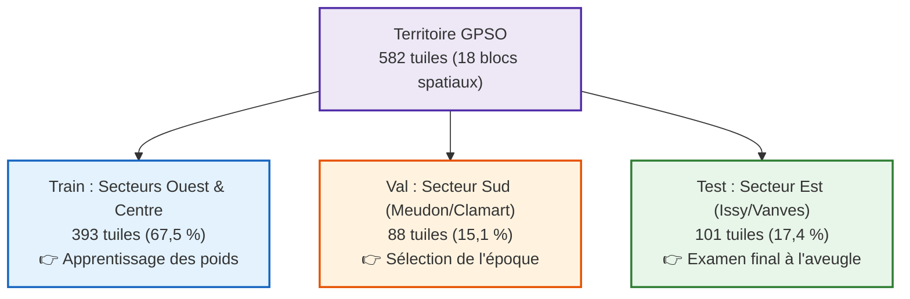

# 01 — Protocole expérimental à découpage spatial disjoint & multi-seed

## 🎯 Objectif
Établir un protocole rigoureux, reproductible et scientifiquement irréprochable pour évaluer et comparer DINOv3 et U-Net ResNet34 sans risque de sur-apprentissage local ni de fuite spatiale.

---

## 🗺️ Le découpage spatial étanche (`split_v2.json`)

Le script [`models/make_split.py`](../../models/make_split.py) regroupe les 582 tuiles selon leur géométrie spatiale en **18 composantes connexes disjointes** :



### 🛡️ Garantie d'étanchéité spatiale (0,0 % de fuite) :
- **Validation** (88 tuiles, Meudon/Clamart) : 100 % de terrain inédit par rapport au Train.
- **Test** (101 tuiles, Issy-les-Moulineaux / Vanves) : 100 % de terrain inédit par rapport au Train et à la Validation.

---

## 📋 Protocole d'entraînement multi-seed (3 runs par modèle)

Pour distinguer les gains réels du modèle du bruit statistique d'initialisation, chaque architecture est entraînée sur 3 graines différentes :

### 1. Entraînement de DINOv3 gelé :
```bash
for s in 0 1 2; do
  python models/dinov3/train_dinov3.py --split split_v2.json --seed $s --epochs 30
done
```

### 2. Entraînement de la baseline U-Net ResNet34 :
```bash
for s in 0 1 2; do
  python models/resnet_unet/train_unet.py --split split_v2.json --seed $s --epochs 30
done
```

---

## ⚖️ Règle d'or de l'évaluation finale
1. **Sélection sur `val`** : La meilleure époque de chaque run est sélectionnée d'après l'IoU sur les 88 tuiles de Meudon.
2. **Évaluation unique sur `test`** : Le volet de test (101 tuiles d'Issy/Vanves) n'est évalué qu'**une seule fois** à la fin.
3. **Publication des résultats** sous la forme :
   $$\text{Score}_{\text{test}} = \mu \pm \sigma\quad (\text{Moyenne} \pm \text{Écart-type sur 3 runs})$$
