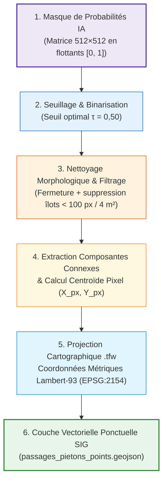

# 02 — Chaîne de vectorisation ponctuelle : du masque binaire aux points SIG

## 🎯 Objectif final
Convertir la carte de probabilités générée par le réseau de Deep Learning en une **couche vectorielle de points géoréférencés (coordonnées Lambert-93 EPSG:2154)** directement exploitable par les services techniques et SIG de GPSO.

---

## ⚙️ Les 5 étapes de l'algorithme de vectorisation

---

## 1. Binarisation & Seuillage
Le réseau produit une matrice de probabilités continues $[0.0, 1.0]$. Un seuil $\tau = 0,50$ sépare le fond des rayures positives.

---

## 2. Filtrage morphologique
- **Fermeture morphologique (Closing)** : comble les éventuels trous fins entre les rayures d'un même passage.
- **Filtrage par aire minimale** : Élimination des composantes connexes $< 100\text{ pixels}$ ($4\text{ m}^2$ au sol), trop petites pour être des passages piétons réglementaires.

---

## 3. Calcul du centroïde et géoréférencement en Lambert-93
Pour chaque composante connexe $k$ de $N_k$ pixels :
$$X_{c, \text{pixel}} = \frac{1}{N_k} \sum_{i=1}^{N_k} x_i, \quad Y_{c, \text{pixel}} = \frac{1}{N_k} \sum_{i=1}^{N_k} y_i$$

Puis conversion en mètres Lambert-93 (EPSG:2154) via le fichier de calage `.tfw` :
$$\begin{pmatrix} X_{\text{Lambert93}} \\ Y_{\text{Lambert93}} \end{pmatrix} = \begin{pmatrix} X_0 \\ Y_0 \end{pmatrix} + \begin{pmatrix} +0.20 & 0 \\ 0 & -0.20 \end{pmatrix} \begin{pmatrix} X_{c, \text{pixel}} \\ Y_{c, \text{pixel}} \end{pmatrix}$$

---

## 📋 Schéma d'attributs de la couche SIG exportée

| Champ | Type | Description | Exemple |
|---|---|---|---|
| `id_passage` | String | Identifiant unique national/territorial | `GPSO_CW_00482` |
| `coord_x_l93` | Float | Coordonnée X Lambert-93 (mètres) | `644527.42` |
| `coord_y_l93` | Float | Coordonnée Y Lambert-93 (mètres) | `6857652.18` |
| `aire_sol_m2` | Float | Surface estimée du passage piéton | `18.4 m²` |
| `confiance_ia` | Float | Score moyen de probabilité DINOv3 | `0.94` |
| `commune_estimee` | String | Commune de rattachement | `Meudon` |
| `date_detection` | Date | Date du run d'inférence | `2026-08-20` |
