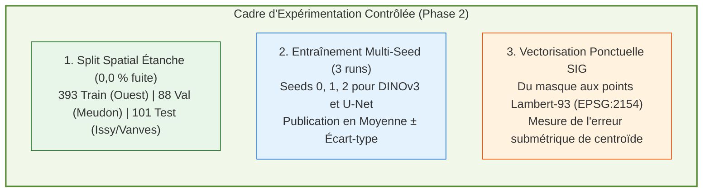

# Phase 2 : Protocole expérimental à données strictement contrôlées

> **Statut** : Protocole figé, prêt pour exécution.  
> **Rôle** : Réaliser l'expérience scientifique définitive sans aucune fuite spatiale, avec mesure de la variabilité statistique (multi-seed) et production du référentiel SIG ponctuel final.

---

## 🛡️ Les 3 piliers de la Phase 2

---

## 📚 Documents de la Phase 2

- [`01_protocole_spatial_disjoint.md`](01_protocole_spatial_disjoint.md) : Découpage spatial v2, scripts d'entraînement et règles d'étanchéité du test à l'aveugle.
- [`02_pipeline_vectorisation_sig.md`](02_pipeline_vectorisation_sig.md) : Algorithme de vectorisation ponctuelle, calcul des centroïdes en Lambert-93 et schéma de données SIG.
