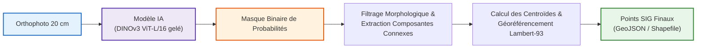

# Cahier de recherche & Protocole scientifique (GPSO 20 cm)

> **Finalité du projet** : Recenser, compter et géolocaliser les passages piétons du territoire Grand Paris Seine Ouest sous forme de **données vectorielles ponctuelles SIG (points Lambert-93 / EPSG:2154)** à partir d'orthophotographies 20 cm de l'IGN.

Ce cahier de laboratoire centralise l'ensemble de la démarche scientifique, de la préparation des données jusqu'au protocole contrôlé de détection et de vectorisation.

---

## 🗺️ Organisation du Cahier de Recherche

```
cahier_recherche/
├── 01_cadrage_et_metriques/               <- L'importance des métriques & finalité métier
│   └── 01_importance_des_metriques.md     <- Ce qu'on veut vs ce qu'on rejette (Pixel vs Objet vs Ponctuel)
│
├── 02_acquisition_de_donnees/             <- Chaîne de préparation : de raw_imgs/ à tiles/
│   ├── README.md                          <- Schéma global du flux de données
│   ├── 01_selection_ortho_ign.md          <- 7 dalles BD ORTHO 20 cm & seuil physique
│   ├── 02_traitements_sig_arcgis.md       <- Chaîne géospatiale ArcGIS (Dissolve, Buffer 50m, Mosaic, Clip)
│   ├── 03_pre_annotation_sam3.md          <- Pré-annotation IA SAM 3, forces & limites illustrées
│   ├── 04_correction_manuelle_expert.md   <- Nettoyage topologique (Divide, Merge) & 672 passages validés
│   └── 05_tuilage_export_tiles.md         <- Export 512x512, stride 256 px, 582 vignettes finales
│
├── 03_phase_1_experience_pilote/          <- Synthèse essentielle de la Phase 1 (faisabilité & fuite)
│   ├── README.md                          <- Bilan des 3 enseignements clés du pilote
│   ├── 01_duel_architectures_initial.md   <- U-Net ResNet34 vs DINOv3 gelé (résultats, télémétrie GPU)
│   └── 02_decouverte_fuite_spatiale.md    <- Le piège du stride 256 px (84% de sol partagé) & limites du pilote
│
└── 04_phase_2_donnees_controlees/         <- La VRAIE expérience scientifique reproductible
    ├── README.md                          <- Vue d'ensemble du protocole à données contrôlées
    ├── 01_protocole_spatial_disjoint.md   <- Split v2 par blocs étanches (0% fuite, 393/88/101) & multi-seed
    └── 02_pipeline_vectorisation_sig.md   <- Du masque IA aux points ponctuels Lambert-93 (GeoJSON final)
```

---

## 🎯 De l'image aérienne au référentiel SIG ponctuel



---

## ⚡ Synthèse des 4 piliers de recherche

1. **Cadrage & Métriques** ([`01_cadrage_et_metriques/`](01_cadrage_et_metriques/01_importance_des_metriques.md)) :
   L'Accuracy au pixel est bannie (classe rare). L'IoU guide l'entraînement, mais les vraies métriques de valeur territoriale sont le **taux de détection d'objet (> 50 %)**, l'**absence de faux positifs**, l'**erreur absolue de comptage** et la **précision submétrique de localisation du centroïde (< 1,5 m)**.
2. **Acquisition de Données** ([`02_acquisition_de_donnees/`](02_acquisition_de_donnees/README.md)) :
   De la BD ORTHO 20 cm IGN brute jusqu'aux 582 tuiles finales, en passant par la pré-annotation IA SAM 3 et le nettoyage topologique manuel de 672 passages piétons vérifiés.
3. **Phase 1 — Expérience Pilote** ([`03_phase_1_experience_pilote/`](03_phase_1_experience_pilote/README.md)) :
   Démonstration de la supériorité de DINOv3 gelé sur U-Net (IoU 0,725 vs 0,663 ; détection 88,1 % vs 79,5 %) et découverte de la fuite spatiale de 84 % liée au stride de 256 px.
4. **Phase 2 — Données Contrôlées** ([`04_phase_2_donnees_controlees/`](04_phase_2_donnees_controlees/README.md)) :
   Protocole d'évaluation définitif sur blocs spatiaux étanches (393 Train, 88 Val, 101 Test $\rightarrow$ **0,0 % de fuite**), entraînement multi-seed (3 graines) et génération de la couche vectorielle ponctuelle finale.
