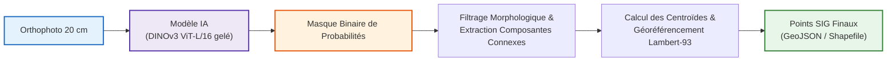

# Cahier de recherche & Protocole scientifique (GPSO 20 cm)

> **Finalité du projet** : Recenser, compter et géolocaliser les passages piétons du territoire Grand Paris Seine Ouest sous forme de **données vectorielles ponctuelles SIG (points Lambert-93 / EPSG:2154)** à partir d'orthophotographies 20 cm de l'IGN.

Ce cahier de laboratoire centralise l'ensemble de la démarche scientifique, de la préparation des données jusqu'au protocole contrôlé de détection et de vectorisation.

---

## 🗺️ Organisation du Cahier de Recherche

```
cahier_recherche/
├── 01_cadrage_et_metriques/               <- L'importance des métriques & finalité métier
│   └── 01_importance_des_metriques.md     <- Ce qu'on veut vs ce qu'on rejette (Pixel vs Objet vs Ponctuel)
│
├── 02_acquisition_de_donnees/             <- Chaîne de préparation : de raw_imgs/ à tiles/
│   ├── README.md                          <- Schéma global du flux de données
│   ├── 01_selection_ortho_ign.md          <- 7 dalles BD ORTHO 20 cm & seuil physique
│   ├── 02_traitements_sig_arcgis.md       <- Chaîne géospatiale ArcGIS (Dissolve, Buffer 50m, Mosaic, Clip)
│   ├── 03_pre_annotation_sam3.md          <- Pré-annotation IA SAM 3, forces & limites illustrées
│   ├── 04_correction_manuelle_expert.md   <- Nettoyage topologique (Divide, Merge) & 672 passages validés
│   ├── 05_tuilage_export_tiles.md         <- Export 512x512, stride 256 px, 582 vignettes (pilote)
│   └── 06_decoupage_train_val_test.md     <- Découpage par quartiers avant tuilage, 3 exports (397/88/101)
│
├── 03_phase_1_experience_pilote/          <- Synthèse essentielle de la Phase 1 (faisabilité & fuite)
│   ├── README.md                          <- Bilan des 3 enseignements clés du pilote
│   ├── 01_duel_architectures_initial.md   <- U-Net ResNet34 vs DINOv3 gelé (résultats, télémétrie GPU)
│   └── 02_decouverte_fuite_spatiale.md    <- Le piège du stride 256 px (84% de sol partagé) & limites du pilote
│
├── 04_benchmark_models/                   <- ⚠️ DRAFT — Bilans de run sous protocole étanche (0 % de fuite)
│   ├── README.md                          <- Protocole commun & tableau comparatif des architectures
│   ├── 01_bilan_dinov3.md                 <- DINOv3 gelé, seed 0 : IoU 0,6384 & détection 87,3 % sur val
│   └── 02_bilan_unet_resnet34.md          <- ⏳ à compléter — entraînement non lancé
│
└── 0?_phase_2_donnees_controlees/         <- ⏳ ANNONCÉ, PAS ENCORE CRÉÉ (numérotation à trancher)
    ├── 01_protocole_spatial_disjoint.md   <- Split v2 par blocs étanches & multi-seed
    └── 02_pipeline_vectorisation_sig.md   <- Du masque IA aux points ponctuels Lambert-93 (GeoJSON final)
```

> ⚠️ **Incohérence de numérotation à arbitrer.** Le dossier `04_phase_2_donnees_controlees/` est annoncé depuis l'origine mais n'existe pas sur le disque, et le rang `04` est désormais occupé par `04_benchmark_models/`. Deux pistes, à trancher avant d'écrire le chapitre de vectorisation :
> - **fusionner** — renommer `04_benchmark_models/` en `04_phase_2_donnees_controlees/` et y ranger le protocole, les bilans de run et la vectorisation comme chapitres `01` à `04` ;
> - **séparer** — garder `04_benchmark_models/` pour les bilans d'architecture et créer un `05_vectorisation_sig/` pour la chaîne masque → points Lambert-93, le protocole spatial étant déjà couvert par le chapitre [`02/06`](02_acquisition_de_donnees/06_decoupage_train_val_test.md).

---

## 🎯 De l'image aérienne au référentiel SIG ponctuel



---

## ⚡ Synthèse des 5 piliers de recherche

1. **Cadrage & Métriques** ([`01_cadrage_et_metriques/`](01_cadrage_et_metriques/01_importance_des_metriques.md)) :
   L'Accuracy au pixel est bannie (classe rare). L'IoU guide l'entraînement, mais les vraies métriques de valeur territoriale sont le **taux de détection d'objet (> 50 %)**, l'**absence de faux positifs**, l'**erreur absolue de comptage** et la **précision submétrique de localisation du centroïde (< 1,5 m)**.
2. **Acquisition de Données** ([`02_acquisition_de_donnees/`](02_acquisition_de_donnees/README.md)) :
   De la BD ORTHO 20 cm IGN brute jusqu'aux jeux d'apprentissage, en passant par la pré-annotation IA SAM 3 et le nettoyage topologique manuel des passages piétons vérifiés. Le découpage **train / val / test se fait par quartiers, avant le tuilage** — 397 tuiles à Boulogne-Billancourt et Sèvres, 88 à Meudon, 101 à Vanves, sans un mètre carré de sol commun entre volets.
3. **Phase 1 — Expérience Pilote** ([`03_phase_1_experience_pilote/`](03_phase_1_experience_pilote/README.md)) :
   Démonstration de la supériorité de DINOv3 gelé sur U-Net (IoU 0,725 vs 0,663 ; détection 88,1 % vs 79,5 %) et découverte de la fuite spatiale de 84 % liée au stride de 256 px.
4. **Benchmark des architectures** ([`04_benchmark_models/`](04_benchmark_models/README.md)) — ⚠️ *DRAFT* :
   Bilans de run sur blocs spatiaux étanches (374 Train, 88 Val, 101 Test $\rightarrow$ **0,0 % de fuite**). Premier chiffre du projet exempt de fuite : DINOv3 gelé, **IoU 0,6384** et **87,3 % de détection d'occurrence** sur la validation. La chute par rapport au pilote (0,725) n'est pas une régression, c'est la correction du biais de 84 %. Le **volet test n'a jamais été ouvert**. Le U-Net ResNet34 du même protocole reste à entraîner.
5. **Vectorisation SIG & évaluation finale** *(à venir)* :
   Recollage des prédictions en Lambert-93, extraction des centroïdes, couche ponctuelle finale — et avec elle les métriques cardinales encore sans chiffre : erreur de centroïde ($< 1,5$ m), MAE de comptage, précision objet. Entraînement multi-seed (3 graines) et ouverture unique du volet test.
